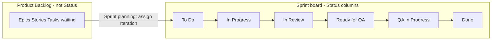

# GitHub Projects — GGZenLab agile setup

Tool chosen for **B-05 Agile PM**: [GitHub Projects](https://docs.github.com/en/issues/planning-and-tracking-with-projects).

## Quick links

| Resource | URL |
|----------|-----|
| New Project | https://github.com/users/gabrielagarayzavalia/projects/new |
| Repo Issues | https://github.com/gabrielagarayzavalia/GGZenLab-Portfolio/issues |
| New Issue (templates) | https://github.com/gabrielagarayzavalia/GGZenLab-Portfolio/issues/new/choose |
| QA seed issues | [SEED_ISSUES.md](SEED_ISSUES.md) — API Testing, Performance |
| PO seed issues (Job Hunter) | [SEED_ISSUES_JOB_HUNTER.md](SEED_ISSUES_JOB_HUNTER.md) — B-06…B-16 |

---

## Two tracks on one board

| Track | Label | Templates | Seed doc |
|-------|-------|-----------|----------|
| **QA** | `track:qa` | Epic, User Story (Gherkin), QA Task | [SEED_ISSUES.md](SEED_ISSUES.md) |
| **Product Owner** | `track:po` | Epic (PO), User Story (PO), PO Task | [SEED_ISSUES_JOB_HUNTER.md](SEED_ISSUES_JOB_HUNTER.md) |

Filter the project by `track:po` or `mini-project:job-hunter` for QA Job Hunter backlog.

---

## GGZenLab workflow (your agile model)

Two **separate** concepts — do not mix them:

| Concept | Where it lives | Meaning |
|---------|----------------|---------|
| **Epic** | **Iteration: Backlog** always (never in a sprint) | Container / mini-project. Tracks progress via linked Stories — **not** a sprint card. |
| **Product Backlog** | **Iteration = Backlog** | Stories and Tasks not yet in the **current sprint**. |
| **Sprint board** | **Current Iteration** + **Status** | Only **User Stories** and **QA Tasks** committed to the sprint. |



### Status field (sprint board only)

Configure **only these** values — **no Backlog, no Ready**:

| Order | Status | Who / what |
|-------|--------|------------|
| 1 | **To Do** | In sprint, not started (replaces “Ready”) |
| 2 | **In Progress** | Dev, automation, or doc work in flight |
| 3 | **In Review** | PR open, spec/report peer review |
| 4 | **Ready for QA** | Handoff to QA; AC and build available |
| 5 | **QA In Progress** | Manual/automated test execution, evidence |
| 6 | **Done** | AC met, evidence attached, accepted |

**Delete** from Status (if the template added them): `Backlog`, `Ready`.

---

## Step 1 — Create the project

1. https://github.com/users/gabrielagarayzavalia/projects/new
2. **Template:** **Team backlog**
3. **Name:** `GGZenLab Portfolio`
4. **Link repo:** `gabrielagarayzavalia/GGZenLab-Portfolio`

---

## Step 2 — Iterations (backlog vs sprint)

1. Project → **⋯** → **Settings** → ensure **Iterations** is enabled (Team backlog includes it).
2. You get a built-in **Backlog** iteration — items here are **not** on the sprint board.
3. Create **Sprint 1** (e.g. 1 week dates).

> **Stop here if the project has no issues yet.** Step 2.4 (sprint planning) is in **Step 8**, after you create and add issues.

---

## Step 3 — Reform Status field

1. Project → **⋯** → **Settings** → **Fields** → **Status** → **Edit**
2. Remove: `Backlog`, `Ready` (and any duplicate).
3. Add / order:

   `To Do` → `In Progress` → `In Review` → `Ready for QA` → `QA In Progress` → `Done`

4. Save.

---

## Step 4 — Two views

### View A — Product Backlog (table)

- **Name:** `Product Backlog`
- **Layout:** Table
- **Filter:** `Iteration` is `Backlog` (or “no iteration”)
- **Group by:** `Epic` or `Mini-project` label
- **Do not** use Status here as “backlog”; iteration is the backlog.

### View B — Sprint board (Kanban)

- **Name:** `Sprint Board`
- **Layout:** Board
- **Filter:** `Iteration` = `@current` **and** `Label` does not include `epic` (or: no filter on label — just never assign Epics to the sprint)
- **Group by:** **Status** (columns = To Do … Done)
- Only **Stories** and **Tasks** in the current sprint; Epics stay in Product Backlog view.

Optional **Table** view for QA traceability: columns Title, Status, AC-ID, Tool, Labels.

---

## Step 5 — Custom fields (optional)

Project → **Settings** → **Fields** → New field:

| Field | Type | Example |
|-------|------|---------|
| AC-ID | Text | AC-001 |
| Mini-project | Single select | api-testing, performance-jmeter |
| Tool | Single select | Postman, Rest-Assured, JMeter |

---

## Step 6 — Labels (repo)

Repo → **Issues** → **Labels**:

| Label | Purpose |
|-------|---------|
| `epic` | Mini-project / skill |
| `user-story` | Gherkin story |
| `task` | Manual or automation work |
| `mini-project:api` | API testing |
| `mini-project:perf` | Performance |
| `qa-manual` | Manual test task |
| `qa-automation` | Automation task |

---

## Step 7 — Create issues (repo) and add to project

**Issues live in the repo first**, then you link them to the Project. An empty project cannot do sprint planning.

### 7.1 Create issues in the repo

Open: https://github.com/gabrielagarayzavalia/GGZenLab-Portfolio/issues/new/choose

**Minimum to start (create in this order):**

| # | Template | Title |
|---|----------|-------|
| 1 | Epic | `[Epic] EPIC-API — API Testing mini-project` |
| 2 | User Story | `[Story] US-API-ABM — REST ABM and listing` |
| 3 | QA Task | `[Task] TC-M-001 — Manual POST create (Postman)` |

Copy bodies from [SEED_ISSUES.md](SEED_ISSUES.md) if templates are empty.

### 7.2 Add issues to the Project

1. Open your **GGZenLab QA Portfolio** project.
2. Bottom of any view → **Add item** (or `+`).
3. Search `EPIC-API` / issue number → Add.
4. Repeat for each issue.

New items should show **Iteration: Backlog** automatically.

### 7.3 Verify Product Backlog view

Open view **Product Backlog** — you should see your 3 issues with Iteration = Backlog.

---

## Step 8 — Sprint planning (this was “step 4.4”)

**Only when issues appear in the project:**

### What goes into the sprint

| Issue type | Sprint? | Iteration | Status on board |
|------------|---------|-----------|-----------------|
| **Epic** | **No** | Always **Backlog** | No Status (or leave unset) — track via linked Stories |
| **User Story** | Yes, if committed | **Sprint 1** | To Do → … → Done |
| **QA Task** | Yes, if committed | **Sprint 1** | To Do → … → Done |

### Fix if Epics landed in To Do (common mistake)

1. Open each **Epic** issue on the project.
2. Set **Iteration** → **Backlog** (not Sprint 1).
3. Clear **Status** (or leave empty) — Epics do not move on the sprint board.
4. Open **Sprint Board** view → filter **Iteration = @current** → only Stories/Tasks should appear.

### Planning a sprint

1. Pick **Tasks** (and optionally **Stories**) from Product Backlog.
2. Set **Iteration** → `Sprint 1`.
3. Set **Status** → `To Do`.
4. Link in issue body: `Parent story: #N` / `Epic: EPIC-API` for traceability.

Epic is “done” when all its child stories are **Done** — not when the Epic card moves columns.

---

## Step 9 — Sprint practice (1 week)

| Day | Action |
|-----|--------|
| Planning | Move 3–5 tasks to **Sprint 1**, Status **To Do** |
| Execute | **In Progress** — Docker lab, run tests |
| Review | **In Review** — link PR or report draft |
| QA handoff | **Ready for QA** — AC listed, SUT up |
| Testing | **QA In Progress** — Postman / Rest-Assured, screenshot |
| Close | **Done** — checkbox AC on issue + evidence |

---

## Traceability

```
Epic (EPIC-API)
  └── User Story (US-API-ABM) ← gherkin/abm-crud.feature
        ├── Task TC-M-001 (Postman) → AC-001
        └── Task TC-A-001 (Rest-Assured) → AC-001
```

Portfolio evidence: screenshot of **Sprint Board** + issue URLs → `projects/api-testing/report/screenshots/`.

Site: [Practice Labs Lab 4](../../../docs/guides/index.html).
